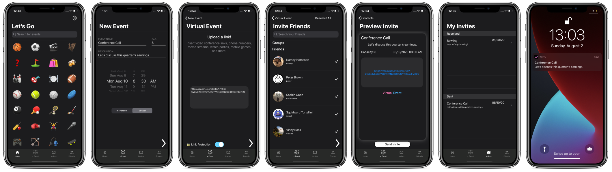
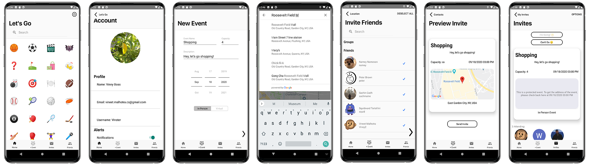

# Wing Mobile

> Wing Mobile is a sustainable cross platform mobile application revolutionizing the way events are created and experienced.   
> As a result of the Covid-19 pandemic, in-person events were no longer feasible and the vast amount of virutal links stemming from different platforms became hard to manage.  
> Enter Wing - your pocket wingman for quickly creating virtual events and safely attending in-person gatherings.

## App Features

<table>  
<tr>
    <td><li>Quick Account Creation & Verification</li></td>
    <td><li>Add Friends Around the World</li></td>
  </tr>
  
  <tr>
    <td><li>Create Virtual/In-Person Events</li></td>
    <td><li>Preset Events Through Emojis</li></td>

  </tr>
  <tr>
    <td><li>Set Capacity / ∞</li></td>
    <td><li>Push Notifications</li></td>

  </tr>
  <tr>
    <td><li>Instantaneous Event Dispatch</li></td>
    <td><li>Invite Friends Outside the App</li></td>

  </tr>
  <tr>
    <td><li>Create Groups</li></td>
    <td><li>Upload Profile Images</li></td>

  </tr>
   <tr>
    <td><li>Block Users, Remove Friends</li></td>
    <td><li>Location and Link Protection Available</li></td>
  </tr>
  
   <tr>
    <td><li>Remove an Unsolicited Event</li></td>
    <td><li>Security - <strong>No Trace</strong> of Event After 1 Hour</li></td>
  </tr>
</table>

## Under the Hood

### Languages and Environments

<table style = "margin-top: -18px;">  

<tr>
    <td><li>Swift - Xcode</li></td>
    <td><li>Java - Android Studio</li></td>
    <td><li>Node.js - Visual Studio</li></td>
  </tr>
  </table>
  

### Technologies

Firebase
 

<table style = "margin-top: -18px">  
<tr>
    <td><li>Authentication, Database, Storage, Cloud Functions, Cloud Messaging, In-App Messaging, Dynamic Links, and Analytics.</li></td>
    
  </tr>
  </table>
  
### Algorithms

<table style = "margin-top: -18px">  
<tr>
    <td><li>Mutlithreading, Sorting, Caching images and User objects, Cloud - username validation (HTTP), database deletion of past events (Scheduled).</li></td>
    
  </tr>
  </table>

### Data Structures

<table style = "margin-top: -18px">  
<tr>
    <td><li>Stacks, Arrays, SortedArray, Lists, Custom User, Friend, Group, and Event structures.</li></td>
    
  </tr>
  </table>

## Download Links
<table>  
<tr>
    <td><li><a href = "https://thewingapp.com/" target="_blank">Available on iOS</a></li></td>
    <td><li><a href = "https://thewingapp.com/" target="_blank">Available on Android</a></li></td>
  </tr>
  </table>

## Website

[https://thewingapp.com/](https://thewingapp.com/)

## Contact and Support
[support@thewingapp.com](mailto:support@thewingapp.com)

